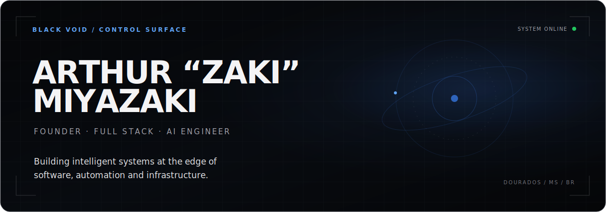
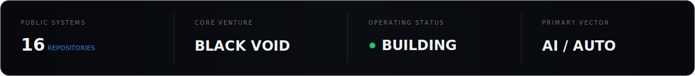

 

---

## Executive Dashboard

 

<table>
<tr>
<td width="50%" valign="top">

### Company Signal

| Vector | Position |
|:--|:--|
| **Venture** | Black Void |
| **Role** | Founder & Full Stack Engineer |
| **Base** | Dourados, MS · Brazil |
| **Status** | `● SYSTEMS IN MOTION` |

</td>
<td width="50%" valign="top">

### Operating System

| Vector | Position |
|:--|:--|
| **Focus** | AI products & automation |
| **Engineering** | Full stack systems |
| **Infrastructure** | Linux · Cloud · Containers |
| **Current mission** | Turn complex workflows into clear software |

</td>
</tr>
</table>

> Founder-led engineering across product, intelligence, automation, and infrastructure — from first architecture to operating software.

---

## Active Projects

<table>
<tr>
<td width="29%" valign="top">

### Black Void

`VENTURE / ACTIVE`

[Open studio ↗](https://blackvoidstudio.vercel.app)

</td>
<td width="71%" valign="top">

**Independent technology venture for building software, AI workflows, and digital infrastructure.**

`Product Engineering`　`Automation`　`Web Systems`　`Infrastructure`

**Mission** — Create focused products where engineering quality and operational usefulness are the brand.

**Public surface**　`███████░░░`　Studio online

</td>
</tr>
</table>

<table>
<tr>
<td width="29%" valign="top">

### TMS

`PRODUCT / BUILDING`

Private system

</td>
<td width="71%" valign="top">

**A transport management initiative centered on operational visibility and controlled workflows.**

`Operations`　`Workflow Design`　`Data Systems`

**Mission** — Consolidate critical transport operations into a single, legible control surface.

**Build signal**　`██████░░░░`　Core systems

</td>
</tr>
</table>

<table>
<tr>
<td width="29%" valign="top">

### KIRA AI

`AI / R&D`

Private initiative

</td>
<td width="71%" valign="top">

**An applied AI initiative exploring useful agents, contextual intelligence, and dependable automation.**

`AI Systems`　`Agents`　`Automation`

**Mission** — Move AI from isolated prompts into reliable, repeatable operating workflows.

**Research signal**　`████░░░░░░`　Architecture

</td>
</tr>
</table>

<table>
<tr>
<td width="29%" valign="top">

### Cinematic Web Architect

`OPEN SOURCE / V1`

[View repository ↗](https://github.com/arthurmi681/skill-web-3D)

</td>
<td width="71%" valign="top">

**A production-oriented AI skill for architecting cinematic, minimalist, high-performance 3D web experiences.**

`Three.js`　`React Three Fiber`　`GLSL`　`GSAP`　`Lenis`

Includes a blueprint workflow, cinematic lighting recipes, shader cookbook, stack decisions, and a performance checklist targeting **60 FPS desktop / 30 FPS mobile**.

**Release readiness**　`████████░░`　Foundation packaged

</td>
</tr>
</table>

---

## Tech Stack

### Languages

### Frameworks

### Database

### Infrastructure

### Cloud

### DevOps

### AI

### 3D Web

---

## Current Roadmap

| State | System milestone | Scope |
|:--:|:--|:--|
| ✅ | Cinematic blueprint workflow | Narrative, visual system, lighting, architecture |
| ✅ | Production reference library | Shaders, performance, stack, lighting |
| ✅ | Black Void public studio | Brand surface deployed on Vercel |
| ✅ | AI automation prototypes | Instagram and Shopify workflows |
| 🔄 | TMS core systems | Operational domain and product workflows |
| 🔄 | KIRA intelligence layer | Agent architecture and automation model |
| ⬜ | Cinematic Web Architect examples | Runnable Three.js / R3F demonstrations |
| ⬜ | Versioned skill releases | Changelog, release packages, validation |
| ⬜ | Unified product observability | Logs, metrics, health, deployment signal |

**MISSION PROGRESS**　`██████░░░░`　**SYSTEMS UNDER ACTIVE DEVELOPMENT**

---

## GitHub Analytics

 

 

---

## Philosophy

<table>
<tr>
<td align="center" width="20%"><strong>01 / DESIGN</strong> Decide before coding.</td>
<td align="center" width="20%"><strong>02 / BUILD</strong> Ship real systems.</td>
<td align="center" width="20%"><strong>03 / AUTOMATE</strong> Remove repetition.</td>
<td align="center" width="20%"><strong>04 / SIMPLIFY</strong> Control complexity.</td>
<td align="center" width="20%"><strong>05 / ENDURE</strong> Think long term.</td>
</tr>
</table>

> Minimalism is focus. Performance is part of the experience. Automation should create leverage. Every system should earn its complexity.

---

## Contact

### Open a channel

**BLACK VOID**　/　AI · AUTOMATION · INFRASTRUCTURE

Founder control surface · Dourados, MS · Brazil

